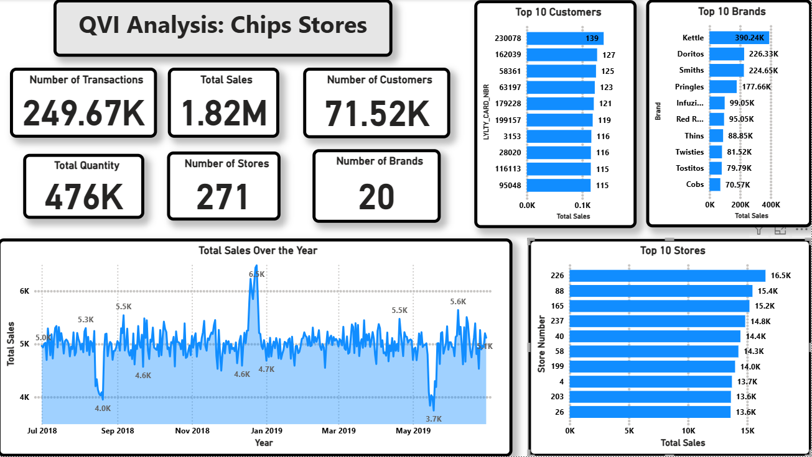

# QVI Analytics

QVI Analytics is a data analysis project focused on understanding customer purchase behavior and transaction patterns. The project leverages various data sources and analytical tools to generate actionable insights for business decision-making.

## Project Overview
- **Objective:** Analyze customer transactions and purchase behavior to uncover trends, patterns, and key insights.
- **Data Sources:**
  - `QVI_Combined_Data.csv`: Combined dataset for analysis
  - `QVI_purchase_behaviour.csv`: Customer purchase behavior data
  - `QVI_transaction_data.xlsx`: Transaction records
  - `Saved_Data/important_customer.csv`: Important customer segment
- **Reports & Outputs:**
  - `QVI_Analysis_Marawany_Summary.md`: Summary of findings
  - `QVI_Analysis_Marawany.html`: Interactive report
  - `QVI_Analysis_Marawany.ipynb`: Jupyter notebook with code and analysis
  - `QVI_Insghits.pbix` / `QVI_Insghits.pdf`: Power BI and PDF reports

## Features

## Power BI Dashboard Example
Below is an example of the interactive dashboard created using Power BI:


)


## Getting Started
1. **Clone the repository:**
   ```powershell
   git clone https://github.com/MohamedMarawany/QVI.git
   ```
2. **Install dependencies:**
   - Open `QVI_Analysis_Marawany.ipynb` in Jupyter Notebook or VS Code
   - Ensure required Python packages (e.g., pandas, matplotlib, seaborn) are installed
3. **Run the analysis:**
   - Execute the notebook cells to reproduce the analysis and visualizations

## Folder Structure
```
QVI/
├── QVI_Analysis_Marawany_Summary.md
├── QVI_Analysis_Marawany.html
├── QVI_Analysis_Marawany.ipynb
├── QVI_Combined_Data.csv
├── QVI_purchase_behaviour.csv
├── QVI_transaction_data.xlsx
├── Saved_Data/
│   └── important_customer.csv
├── QVI_Insghits.pbix
├── QVI_Insghits.pdf
├── QVI.docx
├── QVI.pdf
```

## Contributing
Contributions are welcome! Please open issues or submit pull requests for improvements, bug fixes, or new features.

## License
This project is licensed under the MIT License.

## Author
- Mohamed Marawany
- [GitHub Profile](https://github.com/MohamedMarawany)
